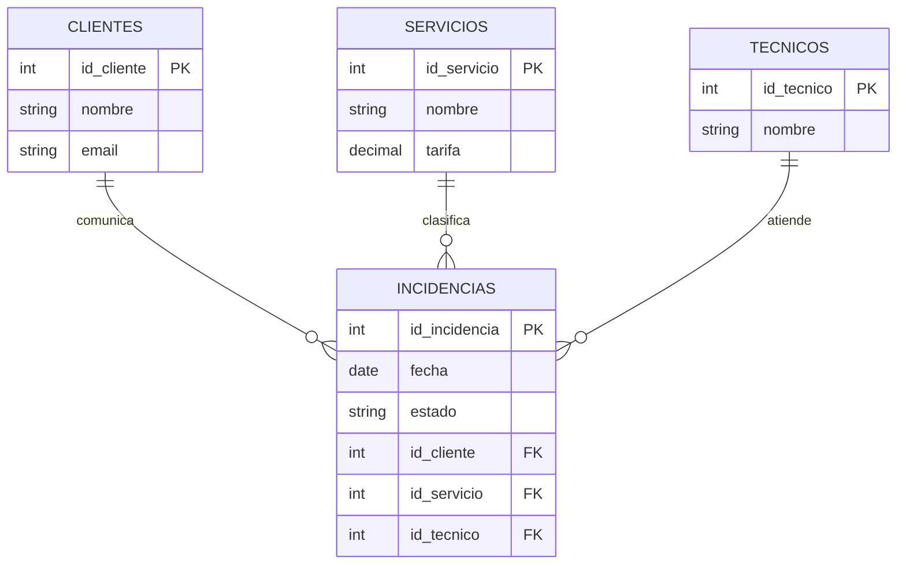

# NexoByte · UD04 resuelta

## Modelo de datos

## Consulta de negocio

**Pregunta:** ¿qué incidencias abiertas llevan más de tres días y quién las atiende?

**Resultado esperado:** identificador, fecha, cliente, servicio, técnico y días abiertos; orden descendente por antigüedad. La consulta no muestra teléfono ni dirección porque no son necesarios.

## Prueba de aceptación

1. Crear un cliente sin repetir su nombre en otras tablas.
2. Abrir una incidencia mediante formulario.
3. Impedir una incidencia asociada a un cliente inexistente.
4. Consultar pendientes de un técnico.
5. Generar informe mensual y exportarlo a PDF.

Una base bonita que falla en cualquiera de estas operaciones no está terminada.

[Descargar modelo SQL de referencia](../assets/ejemplo/nexobyte_modelo.sql){ .md-button }

## Correspondencia con las actividades

| Actividad | Parte de la base modelo |
|---|---|
| A1 | Diagrama de cuatro entidades, claves y cardinalidades |
| A2 | Tablas, relaciones, integridad e importación controlada |
| A3 | Consultas de pendientes, carga, actividad y tiempos |
| A4 | Formulario de incidencia e informe mensual |
| A5 | Las cinco pruebas de aceptación descritas arriba |

**Producto que pasa a UD06:** base funcional sobre la que se escribirá y grabará el tutorial de cliente.
