<section class="hero-aof">
  

    Aplicaciones Ofimáticas · 1.º SMX · 2026–2027
    <h1>Tu primer trabajo empieza aquí</h1>
    
Aprenderás cada aplicación mientras una empresa de servicios digitales nace, crece, consigue clientes y entrega soluciones.

    

      <a class="primary" href="unidades/ud0/">Fundar la empresa</a>
      <a class="secondary" href="metodologia/">Cómo funciona el curso</a>
    

  

</section>

  
<strong>224 h</strong>189 h en centro + 35 h en empresa

  
<strong>9 RA</strong>con trazabilidad curricular

  
<strong>8 + FFE</strong>unidades y formación en empresa

  
<strong>3 proyectos</strong>integradores con defensa

## El contenido oficial dirige el recorrido

El nombre principal de cada unidad identifica el contenido ofimático. El subtítulo explica qué necesidad de la empresa permite aprenderlo. Así es sencillo localizar Writer, Calc, Base o correo sin perder el hilo práctico.

```mermaid
flowchart LR
  U0["UD00 · Proyecto de empresa"] --> U1["UD01 · Suites ofimáticas"]
  U1 --> U2["UD02 · Procesadores de texto"]
  U2 --> U3["UD03 · Hojas de cálculo"]
  U3 --> U4["UD04 · Bases de datos"]
  U4 --> U5["UD05 · Imagen digital"]
  U5 --> U6["UD06 · Vídeo"]
  U6 --> U7["UD07 · Presentaciones"]
  U7 --> U8["UD08 · Correo y agenda"]
  U8 --> U9["Empresa · RA9 Soporte"]
```

## Unidades didácticas

  <a class="unit-card" style="--unit-color:#22c9c3" href="unidades/ud0/">UD00 · PROYECTO DE EMPRESA<b>Fundamos la empresa</b><small>Nombre, servicios, valores, roles y forma de trabajar.</small>Ficha fundacional y pitch</a>
  <a class="unit-card" style="--unit-color:#25a4d8" href="unidades/ud1/">UD01 · SUITES OFIMÁTICAS<b>Preparamos los puestos</b><small>Instalamos y documentamos software legal y seguro.</small>Equipo operativo e informe</a>
  <a class="unit-card" style="--unit-color:#5375df" href="unidades/ud2/">UD02 · PROCESADORES DE TEXTO<b>Creamos documentos corporativos</b><small>Construimos el sistema documental de la empresa.</small>Plantilla, manual y guía</a>
  <a class="unit-card" style="--unit-color:#ec6b4e" href="unidades/ud3/">UD03 · HOJAS DE CÁLCULO<b>Controlamos cuentas e inventario</b><small>Presupuesto, ventas, existencias e indicadores.</small>Libro de gestión y panel</a>
  <a class="unit-card" style="--unit-color:#f29b38" href="unidades/ud4/">UD04 · BASES DE DATOS<b>Gestionamos clientes y servicios</b><small>Convertimos datos dispersos en información fiable.</small>Base de datos operativa</a>
  <a class="unit-card" style="--unit-color:#e64d72" href="unidades/ud5/">UD05 · IMAGEN DIGITAL<b>Diseñamos la marca</b><small>Creamos la campaña y el logo físico en 3D.</small>Kit de marca y pieza 3D</a>
  <a class="unit-card" style="--unit-color:#287e9b" href="unidades/ud6/">UD06 · VÍDEO<b>Formamos al cliente</b><small>Explicamos una solución mediante un tutorial accesible.</small>Videotutorial profesional</a>
  <a class="unit-card" style="--unit-color:#b64f9f" href="unidades/ud7/">UD07 · PRESENTACIONES<b>Defendemos una propuesta</b><small>Unimos datos, imagen y discurso ante el cliente.</small>Presentación y defensa</a>
  <a class="unit-card" style="--unit-color:#875bd2" href="unidades/ud8/">UD08 · CORREO Y AGENDA<b>Organizamos la comunicación</b><small>Correo, contactos, filtros, agenda y reuniones.</small>Sistema de comunicación</a>
  <a class="unit-card" style="--unit-color:#3b8a69" href="unidades/ud9/">FORMACIÓN EN EMPRESA · RA9<b>Prestamos soporte al usuario</b><small>Atendemos incidencias reales y protegemos la información.</small>Tickets y valoración de empresa</a>

## El estándar de la empresa

!!! quote "La pregunta antes de entregar"
    **¿Un cliente que paga aceptaría y utilizaría este trabajo?**

Cada persona conserva evidencias, explica sus decisiones y demuestra el funcionamiento. La IA puede ayudar, pero nunca sustituye la comprensión ni la responsabilidad profesional.
