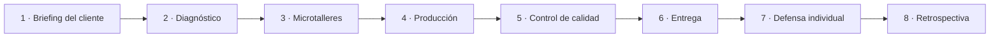

# Cómo funciona la empresa

## La empresa es el curso; los proyectos son sus grandes contratos

Durante todo el año la clase funciona como una empresa de servicios digitales. Cada unidad representa una etapa de crecimiento: aparece una necesidad profesional, se aprenden las herramientas necesarias y se entrega un producto que continuará utilizándose.

| Etapa | Rol del alumnado | Tipo de ayuda |
| --- | --- | --- |
| 1. Fundación | Técnico/a júnior | Modelos, demostraciones y listas de control |
| 2. Integración | Técnico/a | Briefing y criterios; decide parte del procedimiento |
| 3. Autonomía | Responsable de proyecto | Encargo, plazo y estándar de aceptación |

## El ciclo de cada encargo

### 1. Briefing

El alumnado recibe un mensaje realista de gerencia o de un cliente. El encargo indica destinatario, producto, restricciones, plazo y condiciones de aceptación, pero no siempre prescribe todos los pasos.

### 2. Diagnóstico

El equipo identifica qué sabe, qué necesita aprender, qué datos o archivos faltan y qué riesgos existen. Se distribuyen roles sin fragmentar el aprendizaje: todas las personas deben comprender el producto completo.

### 3. Microtalleres

La teoría aparece cuando el encargo la necesita. Una explicación breve se acompaña de ejemplo, práctica guiada y comprobación inmediata. Los apuntes permanecen disponibles como base de conocimiento de la empresa.

### 4. Producción y versiones

Cada producto conserva fuente editable, versión entregable y evidencias. Se usan nombres previsibles: `UD03_A2_Inventario_Equipo03_v02.ods`, nunca `final_bueno_ahora_si.ods`.

### 5. Control de calidad

Antes de entregar se ejecutan pruebas: abrir en otro equipo, modificar datos, comprobar enlaces, revisar accesibilidad, ortografía, formatos, permisos y ausencia de información personal.

### 6. Entrega y defensa

El producto puede ser colectivo; la acreditación del aprendizaje es individual. Cada alumno muestra una operación, explica una decisión y responde a una variación del caso.

## Roles rotatorios

- **Coordinación:** interpreta el briefing y mantiene el tablero.
- **Producción:** impulsa el archivo principal sin convertirse en único autor.
- **Calidad:** diseña y ejecuta pruebas.
- **Documentación:** mantiene evidencias, versiones y fuentes.
- **Relación con cliente:** comunica dudas, cambios y entrega.

Los roles cambian en cada encargo. Nadie puede repetir el mismo durante todo el trimestre.

## Uso de IA

La IA se trata como una herramienta de empresa: puede ayudar a explorar, redactar, detectar errores o generar alternativas. Toda utilización relevante se registra con finalidad, prompt, fragmento utilizado y comprobación. No se introducen datos personales, credenciales ni documentación confidencial.

!!! danger "Responsabilidad profesional"
    Quien firma el producto responde de su calidad. Un contenido generado que no puede explicarse, verificarse o corregirse no acredita aprendizaje.
